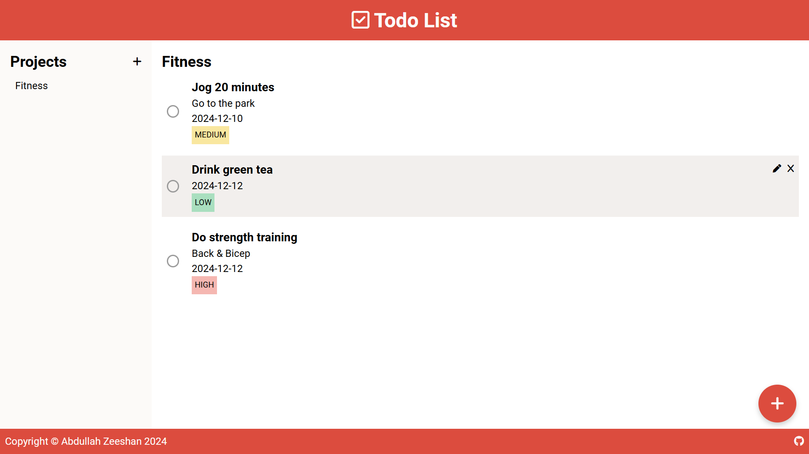

# Todo List

## About

A dynamic todo list web application that allows users to create projects and add tasks, created with vanilla JavaScript.

## Features

- Separate panels for projects (side panel) and tasks (main panel)
- CRUD projects
- CRUD todos within each project
- Setup deadlines to tasks
- Setup priorities (low, medium, high) to tasks
- Add descriptions to tasks

## Background

This project was created as part of [The Odin Project](https://www.theodinproject.com/)'s [Todo List](https://www.theodinproject.com/lessons/node-path-javascript-todo-list) project.

